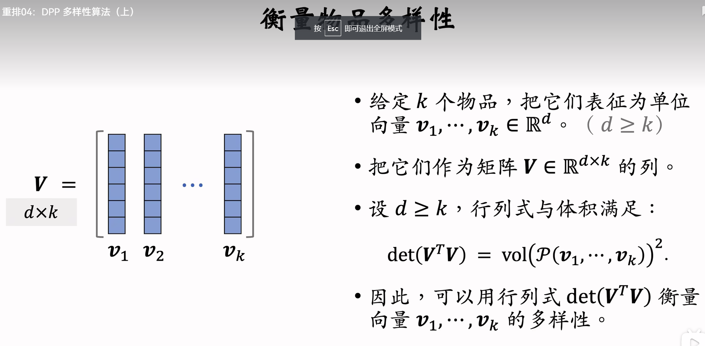
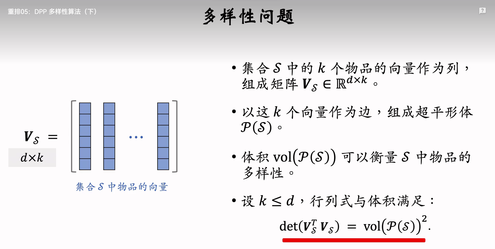
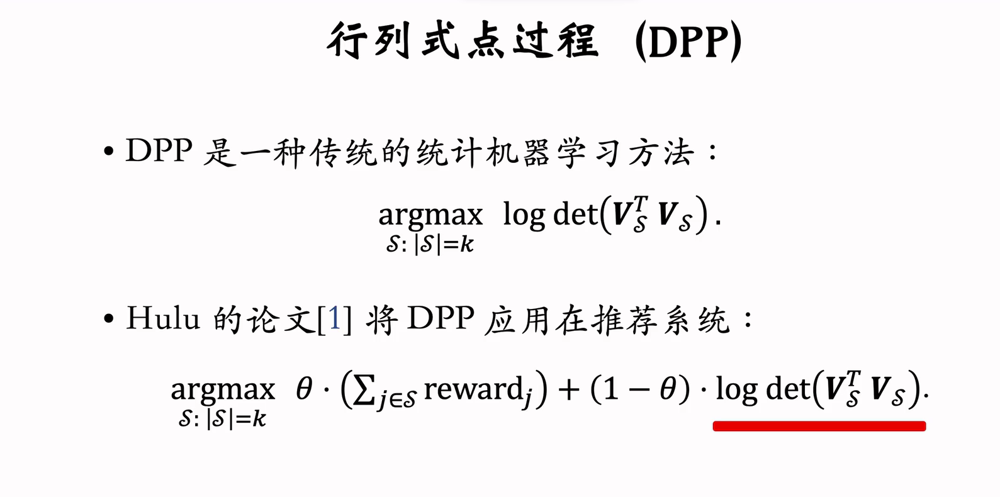

DPP 多样性算法
Determinantal Point Process 行列式点过程 

数学思想：超平形体

衡量物品多样性
即可退出全屏模式
给定k个物品，把它们表征为单位。向量 V1,…,DkERd。(d >=k)
用超平行体的体积衡量物品的多样性，体积介于0和1之间。
·如果V1…,vk两两正交(多样性好)，则体积最大化，vol=1。
·如果V1,…,Dk线性相关(多样性差)，则体积最小化，vol=0。

todo

