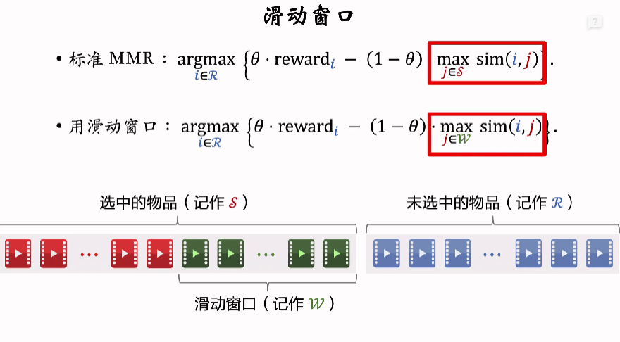

MMR 多样性算法（Maximal Marginal Relevance）最大边界相关性（源于搜索）
MMR多样性算法
每次从未选中集合中选择和已选中集合最不相似的物品
1.已选中的物品S初始化为空集，未选中的物品见初始化为全集{1,…,n}
2.选择精排分数rewardi最高的物品，从集合R移到Sc
3.做k-1轮循环:
a.计算集合见中所有物品的分数{MRi}ieR。
b.选出分数最高的物品，将其从见移到S

MMR :argmax(0.rewardi-(1-0).max sim(i,j))ieSieR

滑动窗口：
(0.rewardi-(1-0)·max sim(i, j))MMR :argmaxjeSiER
·已选中的物品越多(即集合S越大)，越难找出物品iER，使得i与S中的物品都不相似。
设sim 的取值范围是[0,1。当S很大时，多样性分数maxsim(i,j)总是约等于1，导致 MMR 算法失效。ieS
解决方案:设置一个滑动窗口W，比如最近选中的10个品，用W代替 MMR 公式中的S。

